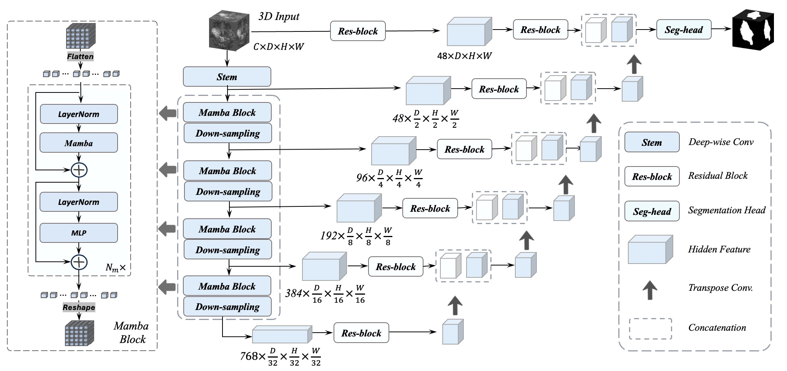
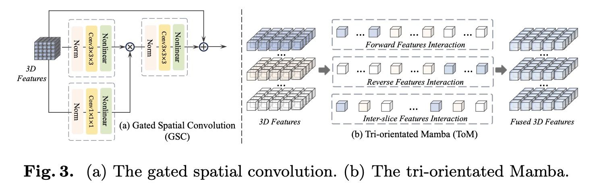

# SegMamba
SegMamba: Long-range Sequential Modeling Mamba For 3D Medical Image Segmentation

[https://arxiv.org/abs/2401.13560](https://arxiv.org/abs/2401.13560)





Our advantage in speed and memory.


## Contact 
If you have any questions about our project, please feel free to contact us by email at zxing565@connect.hkust-gz.edu.cn or via WeChat at 18340097191.

## Environment install
Clone this repository and navigate to the root directory of the project.

```bash
git clone https://github.com/ge-xing/SegMamba.git

cd SegMamba
```
### Install casual-conv1d

```bash
cd causal-conv1d

python setup.py install
```

### Install mamba

```bash
cd mamba

python setup.py install
```

### Install monai 

```bash
pip install monai
```


## Acknowledgement

[https://github.com/Project-MONAI/MONAI](https://github.com/Project-MONAI/MONAI)

[https://github.com/hustvl/Vim](https://github.com/hustvl/Vim)

[https://github.com/bowang-lab/U-Mamba](https://github.com/bowang-lab/U-Mamba)


# Other awesome Mambas in Vision
1. Vivim: a Video Vision Mamba for Medical Video
Object Segmentation [paper](https://arxiv.org/pdf/2401.14168.pdf) | [code](https://github.com/scott-yjyang/Vivim)
2. U-Mamba: Enhancing Long-range Dependency for Biomedical Image Segmentation [paper](https://arxiv.org/abs/2401.04722) | [code](https://github.com/bowang-lab/U-Mamba)

3. Vision Mamba: Efficient Visual Representation Learning with Bidirectional State Space Model [paper](https://arxiv.org/abs/2401.09417) | [code](https://github.com/hustvl/Vim)

4. VMamba: Visual State Space Model [paper](https://arxiv.org/abs/2401.10166) | [code](https://github.com/MzeroMiko/VMamba)

5. Diffusion Models Without Attention [paper](https://arxiv.org/abs/2311.18257) | 
6. MambaMorph: a Mamba-based Backbone with Contrastive Feature Learning for Deformable MR-CT Registration [paper](https://arxiv.org/abs/2401.13934) | [code](https://github.com/Guo-Stone/MambaMorph)
7. Mamba-UNet: UNet-Like Pure Visual Mamba for Medical Image Segmentation [paper](https://arxiv.org/abs/2402.05079) | [code](https://github.com/ziyangwang007/Mamba-UNet)
8. VM-UNet: Vision Mamba UNet for Medical Image Segmentation [paper](https://arxiv.org/abs/2402.02491) | [code](https://github.com/JCruan519/VM-UNet)
9. nnMamba: 3D Biomedical Image Segmentation, Classification and Landmark Detection with State Space Model [paper](https://arxiv.org/abs/2402.03526) | [code](https://github.com/lhaof/nnMamba)
10. Swin-UMamba: Mamba-based UNet with ImageNet-based pretraining [paper](https://arxiv.org/abs/2402.03302) | [code](https://github.com/JiarunLiu/Swin-UMamba)
